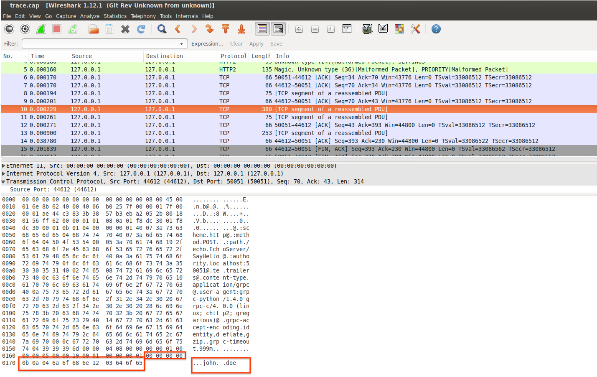
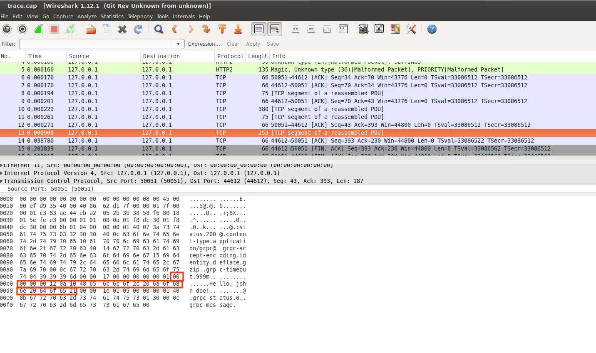

# gRPC with curl

Sample procedure to use curl to make a gRPC call.

[gRPC](https://grpc.io/) is built on top of HTTP2 and is used to make remote procedure calls using [protocol buffers](https://developers.google.com/protocol-buffers/).

gRPC by design is fast, efficient, extensible and portable across many languages.  The only real way to invoke the remote procedure is to use a generated gRPC client which 
internally does all the marshalling to encode the protbuf messages into gRPC's wire format:

- [https://grpc.io/docs/guides/wire.html](https://grpc.io/docs/guides/wire.html)


The procedure described below is a mechanism to invoke a remote GRPC call using and [http2-enabled curl](https://curl.haxx.se/docs/http2.html) and [nghttp2](https://nghttp2.org/) client alone.

This does not serve any real practical purposes other than an investigation into dissecting what goes on in the RPC.  The only usage for this is if running a full
gRPC client is not possible and what is available is the serialized protocol buffer message to transmit.

---

## Installing curl and nghttp2

First step is to install curl and/or nghttp2 clients that are http/2 aware.


```bash
apt-get update -y && apt-get install -y  unzip curl python openssl python-setuptools python-pip python-dev build-essential nghttp2 libnghttp2-dev  libssl-dev

curl -OL https://curl.haxx.se/download/curl-7.54.0.tar.bz2 && \
    tar -xvjf curl-7.54.0.tar.bz2 && \
    cd curl-7.54.0 && \
    ./configure --with-nghttp2 --with-ssl && \
    make && \
    make install && \    
    ldconfig 
```

Verify nghttp2 is enabled properly:

```bash
nghttp -vn https://www.google.com/
[  0.060] Connected
[  0.086][NPN] server offers:
          * grpc-exp
          * h2
          * http/1.1
The negotiated protocol: h2
```

Verify curl is enabled with http/2:

```bash
curl -v --http2 https://www.google.com/
* Using HTTP2, server supports multi-use
* Connection state changed (HTTP/2 confirmed)
```

Alternatively, the docker image [salrashid123/grpc_curl](https://hub.docker.com/r/salrashid123/grpc_curl/))

```bash
$ docker run salrashid123/grpc_curl curl -v --http2 https://www.google.com/

$ docker run salrashid123/grpc_curl nghttp -vn https://www.google.com/
```

---

## Installing gRPC support for python

Setting up client to run the gRPC server locally as well as the client to generate and save the protobuf files is preferably done through
[virtualenv](https://pypi.python.org/pypi/virtualenv):


```bash
git clone https://github.com/salrashid123/grpc_curl
cd grpc_curl/src/

virtualenv env --no-site-packages
source env/bin/activate
pip install grpcio-tools hexdump

python -m grpc_tools.protoc -I .  --python_out=. --grpc_python_out=. echo.proto 
```

## Generate the protobuf wireformat binary file

The first step is to actually write the protobuf message in the wireformat.

The following python code write a protobuf message and converts it to the wireformat:
 - [src/message_util.py](src/message_util.py)

```python
def w(filename):
  req = echo_pb2.EchoRequest(firstname='john', lastname='doe')
  msg = binascii.b2a_hex(req.SerializeToString())
  frame =  '00' + hex(len(msg)/2).lstrip("0x").zfill(8) + msg
  print 'Raw Encode: ' + frame
  f = open(filename, "wb+")
  f.write(binascii.a2b_hex(frame))
  f.close()
```

to invoke this command, simply run:

```bash
python message_util.py write frame.bin
```

or via docker with a  mapped volume:

```
docker run --net=host -v `pwd`:/app/ -t salrashid123/grpc_server python message_util.py read frame.bin
```

The above protobuf writes directly to a binary file and encodes direct.  For manual encoding to see what this is doing:

Start with the protbuf in a file by itself (no encoding done as above; just save a binary file with req.SerializeToString())

```bash
$ xxd frame.bin 
00000000: 0a04 6a6f 686e 1203 646f 65              ..john..doe

$ xxd -p frame.bin
0a046a6f686e1203646f65

$ echo `xxd -p frame.bin`  | xxd -r -p | protoc --decode_raw
1: "john"
2: "doe"
```

then

```python
>>> msg = '0a046a6f686e1203646f65'
>>> print '00' + hex(len(msg)/2).lstrip("0x").zfill(8) + msg
000000000b0a046a6f686e1203646f65
```

```
echo -n '000000000b0a046a6f686e1203646f65' | xxd -r -p - frame.bin
```

- [https://grpc.io/docs/guides/wire.html](https://grpc.io/docs/guides/wire.html)
```
Delimited-Message → Compressed-Flag Message-Length Message
Compressed-Flag → 0 / 1 # encoded as 1 byte unsigned integer
Message-Length → {length of Message} # encoded as 4 byte unsigned integer
Message → *{binary octet}
```

```
compression:
   00
message-length =>11(decimal) octets =>b(hex)
   0000000b
msg:
   0a046a6f686e1203646f65 
```

so the Delimited-Message is
```
000000000b0a046a6f686e1203646f65
```

## Transmit the wireformat binary file


Now that we have a file 'frame.bin' which is the data we want to transmit, transmit and save the output to 'resp.bin':

```
curl -v  -k --raw -X POST --http2  -H "Content-Type: application/grpc" -H "TE: trailers" --data-binary @frame.bin https://main.esodemoapp2.com:50051/echo.EchoServer/SayHello -o resp.bin

nghttp -v -H ":method: POST" -H "Content-Type: application/grpc" -H "TE: trailers" --data=frame.bin https://main.esodemoapp2.com:50051/echo.EchoServer/SayHello
```

Note: main.esodemoapp2.com matches the certificates SAN and points back to localhost:

```bash
$ nslookup main.esodemoapp2.com 8.8.8.8
Server:		8.8.8.8
Address:	8.8.8.8#53

Non-authoritative answer:
Name:	main.esodemoapp2.com
Address: 127.0.0.1
```

```bash
$ openssl x509 -in server_crt.pem  -text -noout
  ...
   Subject: C=US, ST=California, O=Google, OU=Enterprise, CN=main.esodemoapp2.com
  ...
        X509v3 extensions:
            X509v3 Basic Constraints: 
                CA:FALSE
            Netscape Comment: 
                OpenSSL Generated Certificate
            X509v3 Subject Alternative Name: 
                IP Address:192.168.1.3, IP Address:127.0.0.1, DNS:main.esodemoapp2.com
            X509v3 Key Usage: 
                Digital Signature, Non Repudiation, Key Encipherment   
```


## Decode the Response

The response message is alo in formatted so do the inverse of encoding

```bash
 xxd -p resp.bin 
00000000120a1048656c6c6f2c206a6f686e20646f6521
```

which is:
- compression : 00

- message length:  00000012 ->  18 decimal

- message: 0a1048656c6c6f2c206a6f686e20646f6521

```bash
$ echo 0a1048656c6c6f2c206a6f686e20646f6521 | xxd -r -p | protoc --decode_raw
1: "Hello, john doe!"
```


You can use the message utility file do this decoding using the protobuf decoder to do the delimited message -> proto decoder:

```bash
$ python message_util.py read resp.bin 
Got wire_message: 00000000120a1048656c6c6f2c206a6f686e20646f6521
Proto Decode: Hello, john doe!
```

```python
def r(filename):
  f = open(filename, "rb")
  wire_msg = binascii.b2a_hex(f.read())
  f.close()
  print 'Got wire_message: ' + wire_msg
  message_length = wire_msg[4:10]
  msg = wire_msg[10:10+int(message_length, 16)*2]
  r = echo_pb2.EchoReply()
  r.ParseFromString(binascii.a2b_hex(msg))
  print 'Proto Decode: ' + r.message
```

---

### Invoking using the gRPC clients

#### Invoking directly

Assuming you have setup the virtualenv and installed grpc tools

```bash
python server.py
```
then

```bash
python client.py --host main.esodemoapp2.com 50051
```


#### Invoking using docker image

THe same client-server python gRPC scripts are present in a docker image

Server:

```
docker run -p 50051:50051 salrashid123/grpc_curl  python /app/server.py
```

Client
```
 docker run --net=host -t salrashid123/grpc_curl  python /app/client.py main.esodemoapp2.com 50051
```


## Appendix

### gRPC Environment Variables

You can set some [environment variables](https://github.com/grpc/grpc/blob/master/doc/environment_variables.md) if you use [client.py](src/client.py) library for gRPC. 
```
export GRPC_TRACE=all
export GRPC_VERBOSITY=DEBUG
```


### TCPTraces for request and response gRPC calls

The following traces captures the request and response streams while done over a plain HTTP call:

#### EchoRequest



#### EchoResponse



### gRPC Streaming

The gRPC server also has response streaming enabled on the "/echo.EchoServer/SayHelloStream" endpoint.


```bash
curl  -vv -k --raw --http2 -H "Content-Type: application/grpc" -H "TE: trailers" --data-binary @frame.bin https://main.esodemoapp2.com:50051/echo.EchoServer/SayHelloStream -o resp.bin
```

where the response is in the format:

```bash
xxd resp.bin 
00000000: 0000 0000 1f0a 1d53 7472 6561 6d69 6e67  .......Streaming
00000010: 2048 656c 6c6f 2031 202c 206a 6f68 6e20   Hello 1 , john 
00000020: 646f 6521 0000 0000 1e0a 1c53 7472 6561  doe!.......Strea
00000030: 6d69 6e67 2048 656c 6c6f 2032 2c20 6a6f  ming Hello 2, jo
00000040: 686e 2064 6f65 21                        hn doe!

$ xxd -p resp.bin 
000000001f
0a1d53747265616d696e672048656c6c6f2031202c206a6f686e20646f6521
000000001e
0a1c53747265616d696e672048656c6c6f20322c206a6f686e20646f6521
```

```bash
$ echo 0a1d53747265616d696e672048656c6c6f2031202c206a6f686e20646f6521 | xxd -r -p | protoc --decode_raw
1: "Streaming Hello 1 , john doe!"
```

```bash
$ echo 0a1c53747265616d696e672048656c6c6f20322c206a6f686e20646f6521 | xxd -r -p | protoc --decode_raw
1: "Streaming Hello 2, john doe!"
```


### Using python hyper client 

[hyper](https://hyper.readthedocs.io/en/latest/) is an experimental http2 client for python.  You can use this as well but at the time of writing 8/25/17, I have not been enable
to negotiate a proper SSL connection ALPN to proceed.


```python
import ssl
from hyper import HTTPConnection

  context = ssl.SSLContext(ssl.PROTOCOL_SSLv23)
  context.load_verify_locations(cafile="CA_crt.pem")
  context.set_alpn_protocols(['http/1.1', "spdy/1", 'spdy/2', "spdy/3"])
  conn = HTTPConnection('main.esodemoapp2.com', 50051, ssl_context=context, secure=True)
  params = binascii.a2b_hex(frame)
  headers = {"Content-type": "application/grpc", "TE": "trailers"}
  conn.request(method="POST", url="/echo.EchoServer/SayHello", body=params, headers=headers)
  resp = conn.get_response()
  print response.status, response.reason
  #print(resp.read())
```

---
