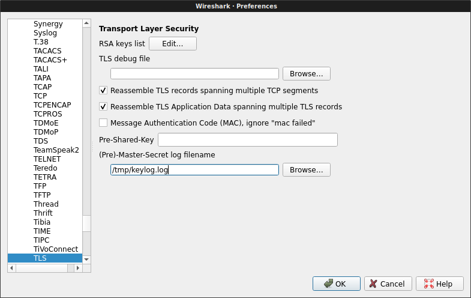
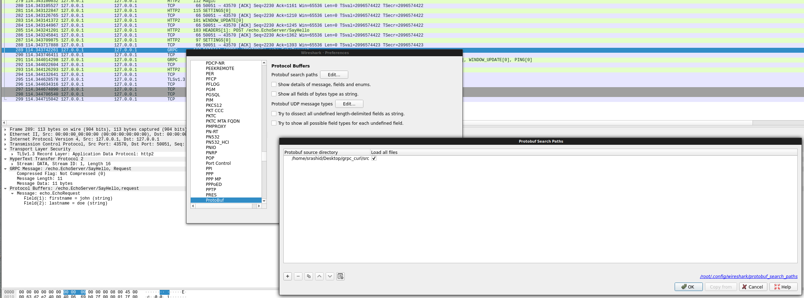

# gRPC with curl

Sample procedure to use curl to make a gRPC call.

[gRPC](https://grpc.io/) is built on top of HTTP2 and is used to make remote procedure calls using [protocol buffers](https://developers.google.com/protocol-buffers/).

gRPC by design is fast, efficient, extensible and portable across many languages.  The only real way to invoke the remote procedure is to use a generated gRPC client which 
internally does all the marshalling to encode the protbuf messages into gRPC's wire format:

- [https://grpc.io/docs/guides/wire.html](https://grpc.io/docs/guides/wire.html)


The procedure described below is a mechanism to invoke a remote GRPC call using and [http2-enabled curl](https://curl.haxx.se/docs/http2.html) and [nghttp2](https://nghttp2.org/) client alone.

This does not serve any real practical purposes other than an investigation into dissecting what goes on in the RPC.  The only usage for this is if running a full
gRPC client is not possible and what is available is the serialized protocol buffer message to transmit.

You can run the sample here by either installing protobuf and gRPC or entirely through the docker container [salrashid123/grpc_curl](https://hub.docker.com/r/salrashid123/grpc_curl/).

---

## QuickStart using docker

[src/Dockerfile](src/Dockerfile) image includes the precompiled gRPC python client/server and curl+http2 clients.   If you want, you can use this docker file entirely
to test with. 


### First familiarize and verify curl and nghttp2 works from within  the container:

```
docker run salrashid123/grpc_curl curl -v --http2 https://www.google.com/
docker run salrashid123/grpc_curl nghttp -vn https://www.google.com/
```

### Start the gRPC server:

```
docker run -p 50051:50051 salrashid123/grpc_curl  python /app/server.py
```

### Make the binary file with the delimited gRPC message:

In a new window:

```
mkdir gcurl
cd gcurl
docker run -v `pwd`:/tmp/gcurl/ \
    -t salrashid123/grpc_curl \
    python /app/message_util.py write /tmp/gcurl/frame.bin
```

### Invoke the gRPC server with curl:

then in the same window as above, transmit the generated file via curl:

```
docker run -v `pwd`:/tmp/gcurl/ \
   --add-host main.esodemoapp2.com:127.0.0.1 \
   --net=host  salrashid123/grpc_curl \
      curl  -v  -k --raw -X POST --http2  \
         -H "Content-Type: application/grpc" \
         -H "TE: trailers" \
         --data-binary @/tmp/gcurl/frame.bin \
         https://main.esodemoapp2.com:50051/echo.EchoServer/SayHello -o /tmp/gcurl/resp.bin
```

The response is written into ```resp.bin```.

### Verify the response message:

Use docer to read in and decode ```resp.bin```.
```
 docker run -v `pwd`:/tmp/gcurl/  -t salrashid123/grpc_curl python /app/message_util.py read /tmp/gcurl/resp.bin
```

ok, so now what you've done is generated a gRPC message, transmitted it via curl and decoded the response..

all of this was done using embedded scripts prettymuch.....so how about doing this by hand?

Lets do just that next:

---

## Invoke gRPC with curl locally

The following steps outlines how to call the gRPC server with curl if curl, protoc, gRPC server runs locally

### Installing curl, if necessary


If you would rather see what is happening in detail, the first step is to install curl and/or nghttp2 clients that are http/2 aware.

NOTE: recent curl version have --http2 support already

Verify curl is enabled with http/2:

```bash
curl -v --http2 https://www.google.com/
* Using HTTP2, server supports multi-use
* Connection state changed (HTTP/2 confirmed)
```


...otherwise, its lengthy..

```bash
apt-get update -y && \
  apt-get install -y  unzip \
    curl python openssl python-setuptools \
    python-pip python-dev build-essential \
    nghttp2 libnghttp2-dev  libssl-dev

curl -OL https://curl.haxx.se/download/curl-7.54.0.tar.bz2 && \
    tar -xvjf curl-7.54.0.tar.bz2 && \
    cd curl-7.54.0 && \
    ./configure --with-nghttp2 --with-ssl && \
    make && \
    make install && \    
    ldconfig 
```

---

### Installing gRPC support for python

Set up a client to run the gRPC server locally as well as the client to generate and save the protobuf files.

This is preferably done through [virtualenv](https://pypi.python.org/pypi/virtualenv):


```bash
git clone https://github.com/salrashid123/grpc_curl
cd grpc_curl/src/

# Use python3

virtualenv env
source env/bin/activate
pip3 install grpcio-tools hexdump

python3 -m grpc_tools.protoc -I .  --python_out=. --grpc_python_out=. echo.proto 
```

## Generate the gRPC wireformat binary file

The first step is to actually write the protobuf message to a file in the wireformat.

The following python code creates a protobuf message and converts it to the wireformat:
 - [src/message_util.py](src/message_util.py)

```python
def w(filename):
  req = echo_pb2.EchoRequest(firstname='john', lastname='doe')
  msg = binascii.b2a_hex(req.SerializeToString())
  ## wireformat
  #frame =  '00' + hex(len(msg)//2).lstrip("0x").zfill(8) + msg.decode("utf-8") 
  ## raw
  frame =  msg.decode("utf-8") 
  print('Raw Encode: ' + frame)
  f = open(filename, "wb+")
  f.write(binascii.a2b_hex(frame))
  f.close()

```

to invoke this command, simply run:

```bash
python3 message_util.py write frame.bin
```


The above snippet writes the message to a binary file in your local directory.  For manual encoding to wireformat starting with just the protobuf:

Start with the protbuf in a file by itself (no encoding done as above; just save a binary file with req.SerializeToString())

```bash
$ xxd frame.bin 
00000000: 0a04 6a6f 686e 1203 646f 65              ..john..doe

$ xxd -p frame.bin
0a046a6f686e1203646f65

$ echo `xxd -p frame.bin`  | xxd -r -p | protoc --decode_raw
1: "john"
2: "doe"
```

then

edit `message_uti.py`, and set to output and save the wireformat message:
```python
>>> msg = '0a046a6f686e1203646f65'
>>> print '00' + hex(len(msg)/2).lstrip("0x").zfill(8) + msg.decode("utf-8") 
000000000b0a046a6f686e1203646f65
```

```
echo -n '000000000b0a046a6f686e1203646f65' | xxd -r -p - frame.bin
```

What is contained in ```frame.bin``` is the gRPC wireformat message in its required format:

From: [https://grpc.io/docs/guides/wire.html](https://grpc.io/docs/guides/wire.html)

```
Delimited-Message → Compressed-Flag Message-Length Message
Compressed-Flag → 0 / 1 # encoded as 1 byte unsigned integer
Message-Length → {length of Message} # encoded as 4 byte unsigned integer
Message → *{binary octet}
```

```
compression:
   00
message-length =>11(decimal) octets =>b(hex)
   0000000b
msg:
   0a046a6f686e1203646f65 
```

so the Delimited-Message is
```
000000000b0a046a6f686e1203646f65
```

### Run a gRPC server

Now run the gRPC server again since we want to transmit this:

You can either run the gRPC server directly if you have gRPC tools available:

```
cd src
python3 server.py
```

### Transmit the wireformat binary file


Now that we have a file 'frame.bin' which is the data we want to transmit and save the output to 'resp.bin':

you can use either curl client:

```bash
curl -v  --raw -X POST --http2  \
    --cacert CA_crt.pem \
    --resolve  server.domain.com:50051:127.0.0.1 \
    -H "Content-Type: application/grpc" \
    -H "TE: trailers" \
    --data-binary @frame.bin \
       https://server.domain.com:50051/echo.EchoServer/SayHello -o resp.bin
```


### Decode the Response

The response message is also in formatted so do the inverse of encoding

```bash
 xxd -p resp.bin 
00000000120a1048656c6c6f2c206a6f686e20646f6521
```

which is:
- compression : 00

- message length:  00000012 ->  18 decimal

- message: 0a1048656c6c6f2c206a6f686e20646f6521

```bash
$ echo 0a1048656c6c6f2c206a6f686e20646f6521 | xxd -r -p | protoc --decode_raw
1: "Hello, john doe!"
```


You can use the message utility file do this decoding using the protobuf decoder to do the delimited message -> proto decoder:

```bash
$ python3 message_util.py read resp.bin 
Got wire_message: 00000000120a1048656c6c6f2c206a6f686e20646f6521
Proto Decode: Hello, john doe!
```

```python
def r(filename):
  f = open(filename, "rb")
  wire_msg = binascii.b2a_hex(f.read())
  f.close()
  print('Got wire_message: ' + wire_msg)
  message_length = wire_msg[2:10]
  msg = wire_msg[10:10+int(message_length, 16)*2]
  r = echo_pb2.EchoReply()
  r.ParseFromString(binascii.a2b_hex(msg))
  print('Proto Decode: ' + r.message)
```

---

### Invoking using the gRPC clients

The following simply details invoking the gRPC client/server as normal; nothing to do with curl+gRPC

#### Invoking directly

Assuming you have setup the virtualenv and installed grpc tools

```bash
python3 server.py
```
then

```bash
# add server.domain.com to /etc/hosts 127.0.0.1

python3 client.py server.domain.com 50051
```


#### Invoking using docker image

THe same client-server python gRPC scripts are present in a docker image

Server:

```
docker run -p 50051:50051 salrashid123/grpc_curl  python3 /app/server.py
```

Client
```
docker run --net=host --add-host server.domain.com:127.0.0.1 -t salrashid123/grpc_curl  python3 /app/client.py server.domain.com 50051
```


## Appendix

### gRPC Environment Variables

You can set some [environment variables](https://github.com/grpc/grpc/blob/master/doc/environment_variables.md) if you use [client.py](src/client.py) library for gRPC. 
```
export GRPC_TRACE=all
export GRPC_VERBOSITY=DEBUG
```


### TCPTraces for request and response gRPC calls

The following traces captures the request and response streams while done over a plain HTTP call:

#### EchoRequest


#### EchoResponse


### gRPC Streaming

The gRPC server also has response streaming enabled on the "/echo.EchoServer/SayHelloStream" endpoint.


```bash
curl  -vv -k --raw --http2 \
   -H "Content-Type: application/grpc" \
   -H "TE: trailers" \
   --data-binary @frame.bin \
   https://server.domain.com:50051/echo.EchoServer/SayHelloStream -o resp.bin
```

where the response is in the format:

```bash
xxd resp.bin 
00000000: 0000 0000 1f0a 1d53 7472 6561 6d69 6e67  .......Streaming
00000010: 2048 656c 6c6f 2031 202c 206a 6f68 6e20   Hello 1 , john 
00000020: 646f 6521 0000 0000 1e0a 1c53 7472 6561  doe!.......Strea
00000030: 6d69 6e67 2048 656c 6c6f 2032 2c20 6a6f  ming Hello 2, jo
00000040: 686e 2064 6f65 21                        hn doe!

$ xxd -p resp.bin 
000000001f
0a1d53747265616d696e672048656c6c6f2031202c206a6f686e20646f6521
000000001e
0a1c53747265616d696e672048656c6c6f20322c206a6f686e20646f6521
```

```bash
$ echo 0a1d53747265616d696e672048656c6c6f2031202c206a6f686e20646f6521 | xxd -r -p | protoc --decode_raw
1: "Streaming Hello 1 , john doe!"
```

```bash
$ echo 0a1c53747265616d696e672048656c6c6f20322c206a6f686e20646f6521 | xxd -r -p | protoc --decode_raw
1: "Streaming Hello 2, john doe!"
```

### Decoding with wireshark

Wireshark provides mechanisms to decode protobuf messages given the `.proto` file. 

Decoding with wireshark for this specific guide involves two steps since we used TLS and will work when used with `curl`

1. Start gRPC server

2. Start Wireshark
  Listen on interface `l0` with filter `tcp.port=50051`
  Configure wirshark's TLS preferences to read Master Keys from `/tmp/keylog.log`

  

3.  Instruct curl to output the SSL keys and invoke client
    We do this so that wireshark can observe the TLS session keys used in the transport

```bash
export SSLKEYLOGFILE=/tmp/keylog.log
curl  -vv -k --raw --http2 \
   -H "Content-Type: application/grpc" \
   -H "TE: trailers" \
   --data-binary @frame.bin \
   https://server.domain.com:50051/echo.EchoServer/SayHelloStream -o resp.bin
```

4. Decode a given protobuf message

Wireshark should decrypt the TLS messages and then with the protobuf decoder, you should be able to see the actual underlying message

You must provide the path to the `echo.proto` file contained in the repo:

  